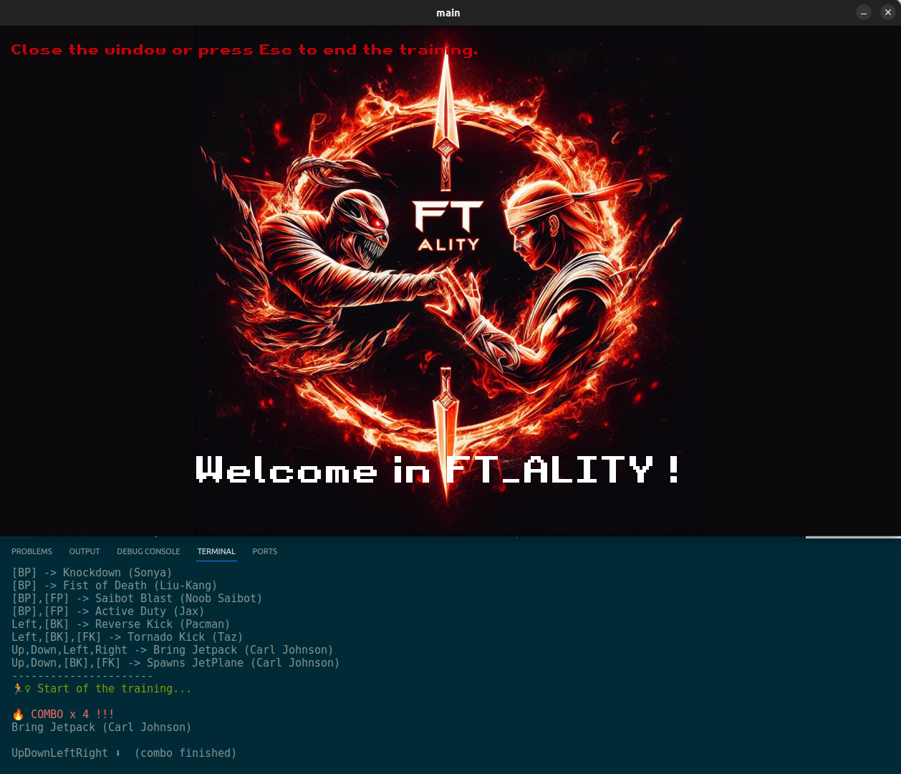

# ft_ality



## Table of content

- [ft\_ality](#ft_ality)
  - [Table of content](#table-of-content)
  - [Presentation](#presentation)
  - [Usage](#usage)
    - [Grammar file](#grammar-file)
  - [Requirements](#requirements)
    - [make](#make)
    - [golang](#golang)
    - [SDL](#sdl)
  - [Technical choices](#technical-choices)
    - [Why golang ?](#why-golang-)
    - [My beginner opinion about golang](#my-beginner-opinion-about-golang)

## Presentation

This project is about learning functionnal programming principles during my school.

The core is about to create a mortal komba-ish training simulation where the code needs to find combo from a given grammar file.
It uses the SDL to listen the keyboard and map to actions accord to the pressed key.

## Usage

### Grammar file

How to format the grammar file :

```txt
(key single uppercase letter (ex: q) OR [Left|Right|Up|Down]):("action name")
...
(key single uppercase letter (ex: q) OR [Left|Right|Up|Down]):("action name")
(SINGLE EMPTY LINE TO SEPARATE ACTIONS THAN COMBOS)
([action name],[action name]):("Combo name")
...
([action name],[action name]):("Combo name")
```

Example :

```txt
q:Block
Down:Down
w:Flip Stance
Left:Left
Right:Right
e:Tag
a:Throw
up:Up
s:[BK]
d:[BP]
z:[FK]
x:[FP]

[BP]:Claw Slam (Freddy krueger)
[BP]:Knockdown (Sonya)
[BP]:Fist of Death (Liu-Kang)
[BP],[FP]:Saibot Blast (Noob Saibot)
[BP],[FP]:Active Duty (Jax)
```

## Requirements

### make

```bash
apt install make
```

### golang

<https://go.dev/doc/install>

### SDL

<https://github.com/veandco/go-sdl2#installation>

Install sdl in macos :

```bash
brew install sdl2{,_image,_mixer,_ttf,_gfx} pkg-config
```

Install sdl on linux using apt :

```bash
apt install libsdl2{,-image,-mixer,-ttf,-gfx}-dev
```

## Technical choices

### Why golang ?

We had the choice of the language but we must apply stricly as possible the functionnal programming guidelines.

I find haskell/ocaml synthax really hard to learn and even if i try to code in it, I could use non-functionnal techniques.
To find something between a language that i have pain in the ass to learn and a language that i already know well, i decided to select golang because i heard of it so many times that i needed to try it.

### My beginner opinion about golang

I found golang really cool to create good compiled binaries in a small amount of time (and lines of code).

Stricly typed is good to have but can be unsafe because is doesn't care if your code could return a null (nil in go) or not. So be careful of segfault !

The modules are really good and it's good to have a well-working package manager for a "low-level" language.

Synthax of local public exported functions that needs to be capitalized is weird at the beginning but it is ok.
Also with the syntax, I code with VsCode and the golang extension refactor automatically my code by default. It is globally ok exept for multi-line conditions that you could have in a complex parser.

Bref, it is a good language that i could find a bit primitive in native features but really great to create binaries faster and safer by default than c or c++.

(I can't compare it to Rust because i never tried it)
